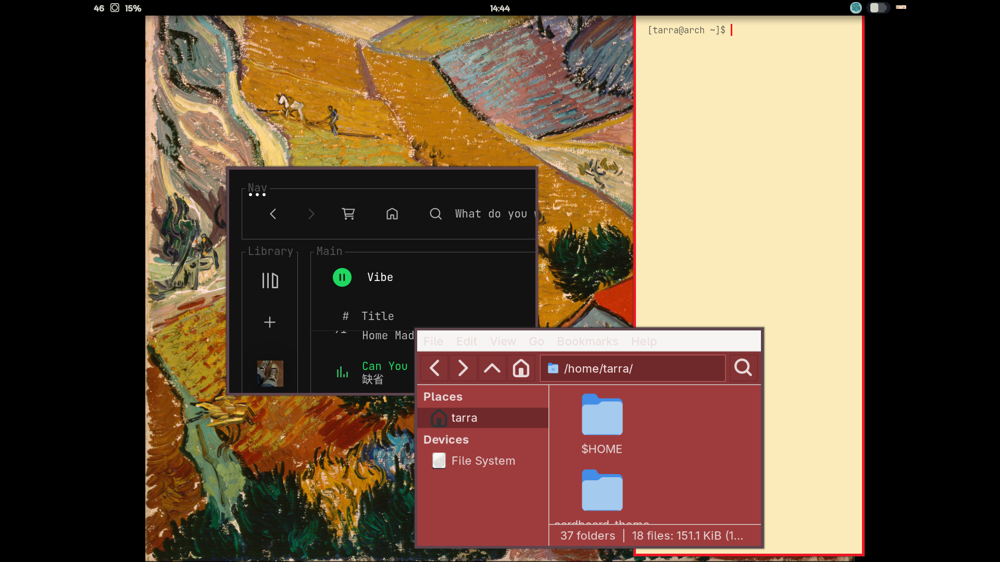

my first repo and project!! (semi ai slop, but not vibecoded) , sharp,red borders, cozy sage terminal ui, idk what to add anymore lol

screenshots

yall please support me by starring this repo
also shoutout to:
termflix (visualizer),
singulartty (audio visualizer)
https://github.com/the-unknown/snglrtty 
feel free for critic me 

## Installation

Clone the repository:

git clone https://github.com/tarranotfound/volkanos.git

Copy the configurations:

cp -r volkanos/waybar ~/.config/
cp -r volkanos/fastfetch ~/.config/
cp volkanos/hyprland.conf ~/.config/hypr/
cp volkanos/hyprland.lua ~/.config/hypr/
cp volkanos/hyprlock.conf ~/.config/hypr/

## Dependencies !!

- Hyprland
- Waybar
- Kitty
- Fastfetch
- Hyprlock
- Fuzzel

